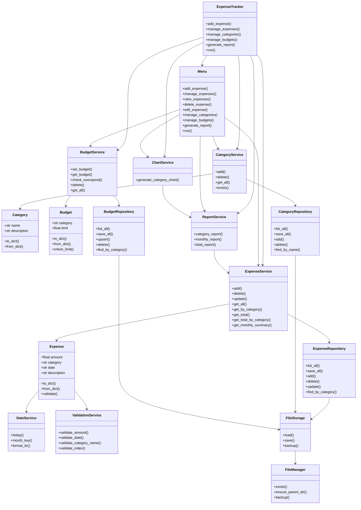

# Controle de Gastos Pessoais

Sistema academico em Python para controle de gastos pessoais. O projeto permite cadastrar categorias, registrar despesas, controlar orcamentos por categoria, gerar relatorios e visualizar um grafico de gastos.

Este projeto foi organizado com foco em Teste de Software: separacao de responsabilidades, regras de negocio isoladas, testes unitarios com `pytest` e relatorio de cobertura com `pytest-cov`.

## Requisitos do trabalho

Requisitos extraidos do arquivo `Trabalho 2 - Teste de Software 2026-1-1.pdf`:

| Requisito do PDF | Situacao do projeto |
| --- | --- |
| Minimo de 10 classes ou arquivos | Atendido: 17 classes de producao e 27 arquivos Python de producao |
| Minimo de 20 metodos ou funcoes | Atendido: 92 metodos/funcoes de producao |
| Casos de teste implementados | Atendido: 137 testes automatizados |
| Indicar como a cobertura foi calculada | Atendido: cobertura calculada via `pytest-cov` |
| Minimo de 70% de cobertura | Atendido: 93% de cobertura em codigo de producao |
| Informar arquivos/classes/metodos e quantos foram testados | Atendido neste README e pelo relatorio `pytest-cov` |

Comando usado para calcular a cobertura:

```bash
python -m pytest --cov=models --cov=services --cov=repositories --cov=storage --cov=ui --cov=utils --cov=expense_tracker --cov-report=term-missing
```

Ultimo resultado verificado:

```text
137 passed
TOTAL: 619 statements, 42 missing, 93% coverage
```

## Funcionalidades

- Gerenciar despesas:
  - visualizar despesas;
  - adicionar despesas;
  - remover despesas;
  - editar despesas.
- Gerenciar categorias:
  - listar categorias cadastradas;
  - adicionar categorias;
  - remover categorias.
- Gerenciar orcamentos:
  - listar orcamentos cadastrados;
  - adicionar orcamento;
  - editar orcamento;
  - excluir orcamento.
- Gerar relatorios:
  - total por categoria;
  - total por mes;
  - grafico de barras por categoria.
- Persistir os dados em arquivo JSON.

## Regras importantes

- Antes de adicionar uma despesa, e necessario cadastrar pelo menos uma categoria.
- Uma despesa so pode usar uma categoria ja cadastrada.
- Um orcamento so pode ser criado para uma categoria ja cadastrada.
- Valores de despesa e limite de orcamento precisam ser maiores que zero.
- Datas devem seguir o formato `AAAA-MM-DD`. Se a data da despesa ficar vazia, o sistema usa a data atual.

## Estrutura do projeto

```text
.
|-- main.py
|-- expense_tracker.py
|-- models/
|   |-- budget.py
|   |-- category.py
|   `-- expense.py
|-- repositories/
|   |-- budget_repository.py
|   |-- category_repository.py
|   `-- expense_repository.py
|-- services/
|   |-- budget_service.py
|   |-- category_service.py
|   |-- chart_service.py
|   |-- date_service.py
|   |-- expense_service.py
|   |-- report_service.py
|   `-- validation_service.py
|-- storage/
|   `-- file_storage.py
|-- ui/
|   `-- menu.py
|-- utils/
|   |-- file_manager.py
|   |-- formatters.py
|   `-- validators.py
`-- tests/
```

## Explicacao da arquitetura

O projeto usa uma arquitetura simples em camadas:

- `models`: classes de dados do dominio, como `Expense`, `Category` e `Budget`.
- `repositories`: classes responsaveis por salvar e recuperar listas de objetos no JSON.
- `services`: regras de negocio, validacoes, relatorios, datas e graficos.
- `storage`: leitura e escrita do arquivo JSON.
- `ui`: menu de terminal, concentrando `input()` e `print()`.
- `utils`: funcoes auxiliares de formatacao, validacao e arquivo.
- `tests`: testes unitarios e testes dos fluxos principais.

A classe `ExpenseTracker` monta todas as dependencias e encaminha chamadas para o menu. Dessa forma, as regras de negocio ficam testaveis sem depender diretamente da entrada do usuario.

## Fluxograma Mermaid das classes e relacoes



## Passo a passo para rodar o projeto

1. Abra o terminal na pasta do projeto:

```bash
cd c:\Users\luanm\despesas
```

2. Crie um ambiente virtual:

```bash
python -m venv .venv
```

3. Ative o ambiente virtual no PowerShell:

```bash
.\.venv\Scripts\Activate.ps1
```

4. Instale as dependencias:

```bash
python -m pip install -r requirements.txt
```

5. Execute o sistema:

```bash
python main.py
```

## Menu principal

```text
1. Gerenciar despesas
2. Gerenciar categorias
3. Gerenciar orcamentos
4. Relatorios / Grafico
5. Sair
```

Fluxo recomendado para testar manualmente:

1. Entre em `Gerenciar categorias`.
2. Cadastre pelo menos uma categoria.
3. Entre em `Gerenciar despesas`.
4. Adicione uma despesa usando uma categoria existente.
5. Entre em `Gerenciar orcamentos`.
6. Adicione, edite ou exclua um orcamento.
7. Entre em `Relatorios / Grafico` para ver os totais.

## Como executar os testes

Execute todos os testes:

```bash
python -m pytest
```

Execute os testes com cobertura:

```bash
python -m pytest --cov=models --cov=services --cov=repositories --cov=storage --cov=ui --cov=utils --cov=expense_tracker --cov-report=term-missing
```

Gerar relatorio HTML de cobertura:

```bash
python -m pytest --cov=models --cov=services --cov=repositories --cov=storage --cov=ui --cov=utils --cov=expense_tracker --cov-report=html
```

Depois abra o arquivo:

```text
htmlcov/index.html
```

## Resumo para apresentacao

- Tipo de software: controle de gastos pessoais.
- Linguagem: Python.
- Interface: terminal.
- Persistencia: JSON.
- Testes: `pytest`.
- Cobertura: `pytest-cov`.
- Quantidade de testes automatizados: 137.
- Cobertura atual de producao: 93%.
- Quantidade de classes de producao: 17.
- Quantidade de arquivos Python de producao: 27.
- Quantidade de metodos/funcoes de producao: 92.
